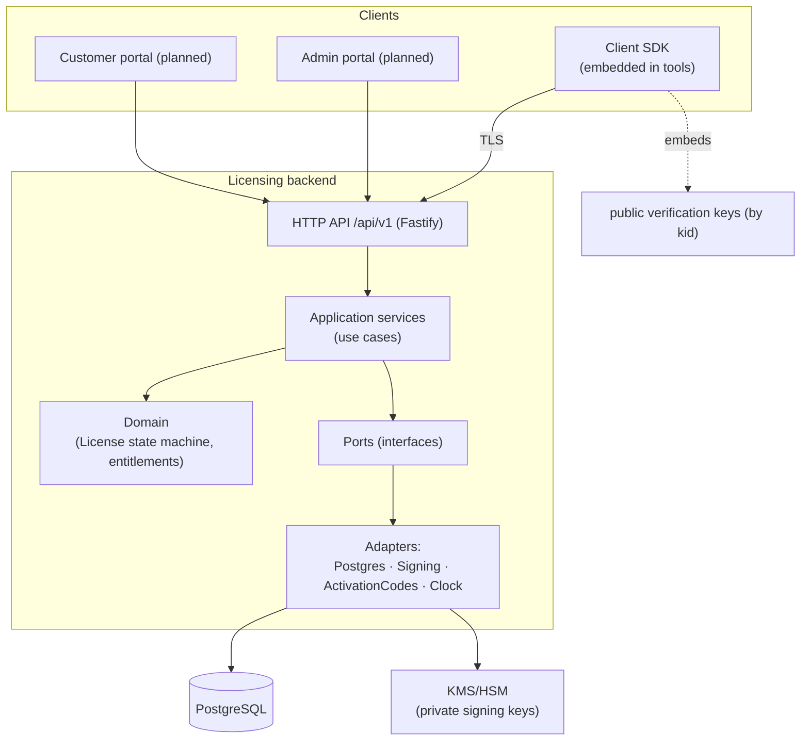
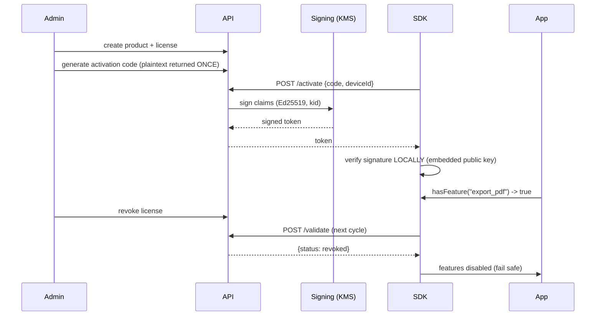

# Vehiclevo Licensing Platform — Architecture

Status: **living document**. Reflects the implemented vertical slice plus the
planned phases. Sections marked _(planned)_ are designed but not yet built.

## 1. Goals & non-goals

**Goals**: sell, issue, activate, validate, renew, suspend, revoke and audit
licenses for multiple commercial products; a reusable client SDK; offline
tolerance; strong key custody; RBAC admin + customer self-service.

**Non-goals / honest limits**: client-side licensing **raises the cost** of
bypass but cannot make software uncrackable. An attacker in full control of a
device can patch checks or run under a debugger. This design targets casual
copying, license sharing, expiry/revocation enforcement, and tamper-evidence.

## 2. Shape: modular monolith

One deployable backend, split into infrastructure-independent domain modules.
Chosen over microservices per the brief; the module seams (ports/adapters) allow
later extraction if scale demands it.

### Layering rule
`domain` depends on nothing. `application` depends on `domain` + `ports`.
`infrastructure` implements `ports`. `api` is transport only. The SDK shares
only the `shared` package (canonical serialization + token verify) — never
server internals or private keys.

## 3. Token vs. server state — the central design decision

| Signed token (immutable proof) | Server state (mutable truth) |
|---|---|
| entitlements, edition, features, seat max | revocation, suspension |
| validity window, offline window, grace | current seat leases |
| issuer/audience, keyId, tokenId | last-seen, activation records |

The SDK trusts the **token** offline for entitlements; it must contact the
server to learn **mutable** facts (revocation/suspension). Short token TTL +
`offlineUntil` bound how long a client can go without re-checking.

## 4. Signing & key rotation

- Algorithm: **Ed25519 (EdDSA)** via Node `crypto` (libcrypto). No custom crypto.
- Token envelope: JWS-like `b64url(header).b64url(payload).b64url(sig)`, payload
  in **canonical JSON** (RFC 8785 spirit) so re-serialization is byte-stable.
- `kid` in the header selects the verification key. Rotation = publish a new
  `kid`, ship it in the client trust store (clients hold current + next), flip
  the active signer. Old tokens still verify until they expire.
- Private keys live only in KMS/HSM in staging/production. The `local` provider
  is dev-only and blocked in `production` by config validation.

## 5. Offline & anti-rollback

- After a successful online exchange the SDK caches the signed token and the
  highest server time it has seen.
- On network failure it falls back to the cached token, honoring `expiresAt`,
  `gracePeriodSeconds`, and `offlineUntil`.
- If the local clock is more than a small skew earlier than the last observed
  server time, the SDK reports `clock_tampered` and denies — blunting
  "set the date back" attacks.

## 6. Data model

See `packages/server/migrations/001_init.sql` for the full schema and the
ER model in `docs/threat-model.md`/README. Concurrency: optimistic `version`
columns for admin edits; floating-seat enforcement _(planned)_ uses row locks /
conditional `UPDATE ... WHERE active < max`.

## 7. Deployment _(planned detail)_

Containerized; separate dev/staging/prod config; DB migrations on release;
OpenTelemetry traces/metrics/logs (no secrets, no raw tokens); health/readiness
endpoints exist today (`/health`, `/ready`).

## 8. Implemented vs. planned

| Area | Status |
|---|---|
| Canonical serialization + Ed25519 sign/verify | ✅ implemented + tested |
| License state machine + core use cases | ✅ implemented + tested |
| Activation code gen/hash (HMAC + pepper) | ✅ implemented + tested |
| HTTP API (activate/validate/admin/revoke) | ✅ implemented + tested |
| SDK (init/activate/validate/hasFeature/offline/rollback) | ✅ implemented + tested |
| In-memory repositories | ✅ (used by demo + tests) |
| Admin portal (React SPA) + read/mgmt API | ✅ products/licenses/detail/suspend/resume/renew/revoke/audit + tests |
| RBAC — five roles, permission matrix, per-endpoint enforcement | ✅ implemented + tested (see ADR-0005) |
| Postgres adapters + migration runner, wired end-to-end | ✅ implemented + integration-tested (incl. concurrent seat cap) |
| OIDC auth (Entra ID/Keycloak) behind auth port | ⏳ API-key resolver today; OIDC resolver planned |
| Offline file req/resp, trials, transfer | ⏳ planned (P3) |
| Floating leases (atomic checkout) | ⏳ schema ready; logic planned (P4) |
| Customer portal | ⏳ planned (P5) |
| Reporting, key rotation runbook, monitoring | ⏳ planned (P6) |
