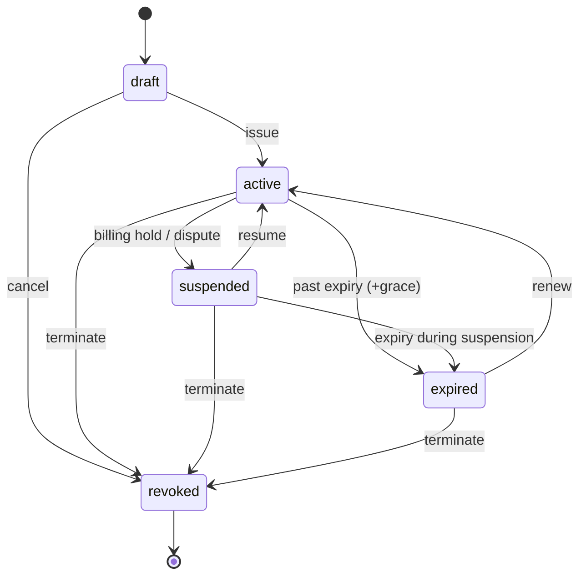

# License lifecycle / state machine

Implemented in `packages/server/src/domain/license.ts` (`TRANSITIONS`), enforced
by `assertTransition` and covered by tests.

## Rules
- `revoked` is **terminal** — no outgoing transitions. Revocation is recorded in
  a dedicated `revocations` table and surfaced by online validation.
- `expired` is recoverable via renewal (→ `active`).
- Suspension is reversible; it blocks validation but preserves activations.
- Every transition writes an **audit event** with a non-sensitive metadata bag
  (never codes/tokens/secrets).
- Admin edits use an optimistic-concurrency `version` to reject lost updates.

## Effect on validation
| Status | `/validate` result | SDK outcome |
|---|---|---|
| active (in window) | `valid` + fresh token | features enabled |
| active (past expiry+grace) | `expired` | features disabled |
| suspended | `suspended` | features disabled |
| revoked | `revoked` | cache cleared, features disabled |
| draft | `not_active` | features disabled |
